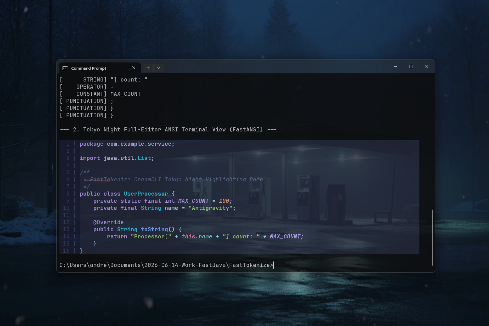

# FastTokenize 0.1.0 [ALPHA] — Ultra-Fast Code & Syntax Tokenizer for Java

[](https://github.com/andrestubbe/FastTokenize/releases/tag/0.1.0)
[](https://opensource.org/licenses/MIT)
[](https://www.java.com)
[]()
[](https://jitpack.io/#andrestubbe/FastTokenize)

---

**⚡ Minimal, deterministic, zero-dependency tokenization engine for code analysis, syntax highlighting, and LLM text pipelines. Operates in $O(n)$ time with zero-allocation byte-array output.**

---

[](https://www.youtube.com/watch?v=BZsqQl7WqWk)

---

## ⚡ Key Features

- 🚀 **Ultra-Fast $O(n)$ Tokenization** — Process source code files in microseconds with zero GC pressure.
- 🎨 **Multi-Language Support** — Native dedicated scanners for **Java, C/C++, Python, C#, JavaScript, TypeScript, JSON, CSS, XML/HTML, Markdown**.
- 🖌️ **Zero-Allocation Style Engine** — Generates byte-array style IDs directly mapping to character offsets for `FastTerminal` & CreamCLI.
- 📁 **Automatic File Detection** — Instantly resolves the optimal scanner via `FastTokenize.tokenizeForFile("app.cpp", code)`.
- 📦 **Zero External Dependencies** — Standalone, lightweight JAR (< 50 KB).
- 🔗 **Part of the FastJava Ecosystem** — Seamlessly integrates with `FastTerminal`, `FastAI`, and `FastFileIndex`.

---

## 🚀 Quick Start

### 1. Simple Tokenization

```java
import fasttokenize.FastTokenize;
import fasttokenize.Language;
import fasttokenize.Token;
import java.util.List;

public class Demo {
    public static void main(String[] args) {
        String javaCode = """
            public class HelloWorld {
                public static void main(String[] args) {
                    System.out.println("Hello, FastTokenize!"); // Print
                }
            }
            """;

        // Tokenize for Java
        List<Token> tokens = FastTokenize.tokenize(Language.JAVA, javaCode);
        
        for (Token t : tokens) {
            System.out.println(t.getType() + " => " + t.getText());
        }
    }
}
```

### 2. Auto-Detect Language from Filename

```java
String csharpCode = "string message = @\"C:\\Projects\\FastTokenize\";";

// Automatically detects C# scanner from extension .cs
List<Token> tokens = FastTokenize.tokenizeForFile("Program.cs", csharpCode);
```

### 3. High-Speed Terminal Style Byte-Stream (CreamCLI / FastTerminal)

```java
String pyCode = "@property\ndef is_active(self):\n    return True\n";

// Returns a zero-allocation byte array matching each character's TokenType ID
byte[] styleIds = FastTokenize.tokenizeStyles(Language.PYTHON, pyCode);
```

---

## 🌐 Supported Languages & Formats

| Language / Format | Extensions | Dedicated Scanner | Key Constructs Handled |
| :--- | :--- | :--- | :--- |
| **Java / Kotlin** | `.java`, `.kt` | `JavaScanner` | Javadoc, Annotations (`@Override`), Generics, Literals |
| **C / C++** | `.c`, `.cpp`, `.h`, `.hpp` | `CppScanner` | Preprocessor (`#include`, `#define`), Intrinsics, Namespaces |
| **Python** | `.py`, `.pyw`, `.pyi` | `PythonScanner` | Triple Quotes (`"""`), Decorators (`@property`), Raw Strings |
| **C# (.NET)** | `.cs`, `.csx` | `CSharpScanner` | Verbatim (`@""`), Interpolation (`$""`), Attributes, Async |
| **JS / TS / JSX** | `.js`, `.ts`, `.jsx`, `.tsx` | `CppScanner` | Template Literals, React Components, Arrow Functions |
| **JSON** | `.json` | `JsonScanner` | Property Keys (`"key":`) vs Values, Exponents, Booleans |
| **CSS / SCSS** | `.css`, `.scss`, `.less` | `CssScanner` | At-Rules (`@media`), Selectors (`.class`, `#id`), Variables |
| **XML / HTML** | `.xml`, `.html`, `.svg` | `XmlScanner` | Directives (`<?xml?>`), Tags, Attributes, Comments (`<!-- -->`) |
| **Markdown** | `.md`, `.markdown` | `MarkdownScanner` | Headers (`#`), Fenced Code Blocks (`` ``` ``), Links |

---

## 📦 Installation

### Maven (JitPack)

Add the JitPack repository and dependency to your `pom.xml`:

```xml
<repositories>
    <repository>
        <id>jitpack.io</id>
        <url>https://jitpack.io</url>
    </repository>
</repositories>

<dependencies>
    <dependency>
        <groupId>com.github.andrestubbe</groupId>
        <artifactId>FastTokenize</artifactId>
        <version>0.1.0</version>
    </dependency>
</dependencies>
```

---

## 📄 Documentation

- **[Language Test Corpus](docs/samples/README.md)** — Complete spectrum of reference test files for all supported languages.
- **[PHILOSOPHY.md](docs/PHILOSOPHY.md)** — Engineering rationale for $O(n)$ zero-allocation tokenization.
- **[ROADMAP.md](docs/ROADMAP.md)** — Future milestones and C++/AVX2 SIMD native bridge plans.

---

## ⚖️ License

MIT License — see [LICENSE](LICENSE) for details.

---

**Part of the FastJava Ecosystem**  
*Making the JVM faster. Small package. Maximum speed. Zero bloat. 🚀*
