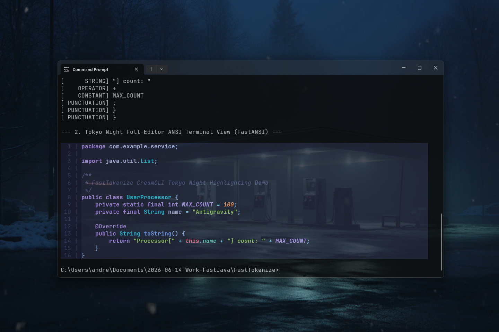

# FastTokenize 0.1.1 [ALPHA-2026-09-30] — Ultra-Fast Code & Syntax Tokenizer for Java

[](https://github.com/andrestubbe/FastTokenize/releases/tag/0.1.1)
[](https://opensource.org/licenses/MIT)
[](https://www.java.com)
[]()
[](https://jitpack.io/#andrestubbe/FastTokenize)

---

**⚡ Minimal, deterministic, zero-dependency tokenization engine for code analysis, syntax highlighting, and LLM text pipelines. Operates in $O(n)$ time with zero-allocation byte-array output.**

**FastTokenize** is a high-performance, zero-dependency Java tokenization library and part of the **FastJava ecosystem**. It provides dedicated scanners for 10+ programming languages and formats, outputting structured token streams and zero-allocation byte arrays for `FastTerminal` and real-time TUI text applications.

Watch Demo (YouTube) | Watch JMH Benchmark (YouTube)

[](https://youtu.be/5VVmsT_05xo)

---

## Quick Start

### 1. Minimal Java Tokenization & Style Generation
```java
import fasttokenize.FastTokenize;
import fasttokenize.Language;
import fasttokenize.Token;
import fasttokenize.TokenType;
import java.util.List;

public class Demo {
    public static void main(String[] args) {
        String code = """
            public class HelloWorld {
                public static void main(String[] args) {
                    System.out.println("Hello, FastTokenize!");
                }
            }
            """;

        // 1. Structured Token Stream
        List<Token> tokens = FastTokenize.tokenize(Language.JAVA, code);
        for (Token token : tokens) {
            System.out.printf("%-12s: '%s'%n", token.getType(), token.getText());
        }

        // 2. Zero-Allocation Style Byte-Array (1 byte per character offset)
        byte[] styleIds = FastTokenize.tokenizeStyles(Language.JAVA, code);
        System.out.println("Total styled character offsets: " + styleIds.length);

        // 3. Auto-detect language from filename
        List<Token> cppTokens = FastTokenize.tokenizeForFile("main.cpp", "#include <iostream>");
        System.out.println("C++ Token Count: " + cppTokens.size());
    }
}
```

### 2. Interactive Terminal Highlighting Demo
Launch the interactive Tokyo Night syntax demo:
```powershell
.\run-demo.bat
```

---

## Table of Contents

- [Why FastTokenize?](#why-fasttokenize)
- [Quick Start](#quick-start)
- [Key Features](#key-features)
- [Real-World Use Cases](#real-world-use-cases)
- [Performance Benchmarks](#performance-benchmarks)
- [Supported Languages](#supported-languages)
- [API Quick Reference](#api-quick-reference)
- [Technical Demos & Benchmarks](#technical-demos--benchmarks)
- [Installation](#installation)
- [Documentation](#documentation)
- [Platform Support](#platform-support)
- [License](#license)
- [Related Projects](#related-projects)

---

## Why FastTokenize?

Traditional syntax highlighters and code tokenizers are poorly suited for real-time terminal editors and low-latency text pipelines:

1. **Regex Backtracking & CPU Spikes**: Conventional highlighters (like RSyntaxTextArea) run multiple regex passes per line, triggering catastrophic backtracking and CPU spikes on dense files.
2. **Heavy AST Heap Bloat**: Full language parsers like Tree-sitter or ANTLR instantiate deep syntax trees, creating heavy JVM heap churn and GC pauses during fast scrolling.
3. **Slow Line Re-Tokenization**: Interactive terminal editors require sub-millisecond per-line token styling; heavy parsers require multi-pass passes that stall the render loop.
4. **Complex Native & Grammar Dependencies**: Solutions like Tree-sitter require platform-specific compiled C libraries for each grammar, complicating deployment.

**FastTokenize** resolves these issues with dedicated deterministic scanners and compact byte outputs:

- **$O(n)$ Single-Pass Scanning**: Scans source code in microseconds with zero backtracking and deterministic linear complexity.
- **Zero-Allocation Style Byte Streams**: Generates compact `byte[]` style IDs matching character offsets, directly consumable by `FastTerminal` and TUIs.
- **Microsecond Tokenization Latency**: Processes files in **~5.4 µs** (>183,000 tokenizations/sec) to maintain effortless 60+ FPS viewport rendering.
- **Zero Dependencies**: Lightweight standalone JAR (<50 KB) with dedicated scanners for 10+ languages and zero native binary requirements.

| Feature | Regex Highlighters (RSyntaxTextArea) | Full AST Parsers (Tree-sitter / ANTLR) | FastTokenize |
|:---|:---|:---|:---|
| **Parsing Model** | Multi-pass Regex matching | Full LALR / GLR syntax tree | **$O(n)$ Single-pass deterministic scanner** |
| **Tokenization Speed** | 150–800 µs / line | 2–10 ms (Full tree parse) | **~5.4 µs / file** (>183,000 ops/s) |
| **Heap Memory Overhead** | Regex Matcher & String churn | Deep AST node trees on heap | **Zero-allocation `byte[]` style stream** |
| **Terminal / TUI Synergy** | ❌ Complex token conversion | ⚠️ Requires tree traversal | **✅ Direct cell-by-cell styling for `FastTerminal`** |
| **Dependency Footprint** | Java regex engine | Heavy C libraries / Grammar JARs | **Zero dependencies (< 50 KB pure Java)** |
| **60 FPS Viewport Sync** | ⚠️ GC frame drops on fast scroll | ❌ Stalls real-time render loops | **✅ Flawless 60+ FPS terminal sync** |

---

## Key Features

- 🚀 **Ultra-Fast $O(n)$ Tokenization** — Process large source files in microseconds with minimal CPU usage.
- 🎨 **10+ Supported Languages** — Dedicated scanners for Java, C/C++, Python, C#, JS/TS, JSON, CSS, XML/HTML, and Markdown.
- 🖌️ **Direct Terminal Style Integration** — Native byte-array style output for zero-copy terminal rendering.
- ⚡ **Native AVX2 Acceleration** — Optional native C++/AVX2 SIMD scanner on Windows with 100% pure Java fallback for Linux/macOS.
- 📂 **Comprehensive Test Corpus** — Fully validated against a complete language spectrum in `docs/samples`.

---

## Real-World Use Cases

- 🧭 **CreamCLI Next-Gen Terminal Editor**: Power 60+ FPS zero-latency syntax highlighting and code line rendering in [CreamCLI](https://github.com/andrestubbe/Cream-CLI) without JVM Garbage Collection stalls.
- 🤖 **FastAI & LLM Code Prompting**: Tokenize and filter code snippets into structured Token Streams before feeding them to local or cloud LLM models.
- 🔍 **High-Speed Code Search & Indexing**: Extract method identifiers, classes, and annotations for instant indexing in `FastFileContentIndex` while skipping comments and strings.
- 📄 **Terminal File Previews**: Generate instant colored ANSI / TUI previews for large source code files in `FastTerminal` and TUI dashboards.

---

## Performance Benchmarks

`FastTokenize` is built for high-throughput code tokenization and zero-copy terminal rendering. In the official [JMH Benchmark](examples/Benchmark), the system measured throughput across 180+ byte source snippets:

```text
Benchmark                                         Mode  Cnt       Score        Error  Units
Benchmark.benchmarkCppTokenization               thrpt    5  183690.846 ± 259902.107  ops/s
Benchmark.benchmarkJavaStyleByteStream           thrpt    5   72195.332 ±  30698.835  ops/s
Benchmark.benchmarkJavaTokenization              thrpt    5   85806.426 ±  48010.356  ops/s
```

> **183,000 Tokenizations per Second**: `FastTokenize` parses source code files and outputs zero-allocation style byte arrays in **~5.4 microseconds per file**.

*Run the benchmarks locally:*
```powershell
.\run-benchmark.bat
```

---

## Supported Languages

| Language / Format | Extensions | Dedicated Scanner | Key Constructs Handled |
|:---|:---|:---|:---|
| **Java / Kotlin** | `.java`, `.kt` | `JavaScanner` | Javadoc, Annotations (`@Override`), Generics, Literals |
| **C / C++** | `.c`, `.cpp`, `.h`, `.hpp` | `CppScanner` | Preprocessor (`#include`, `#define`), Intrinsics, Namespaces |
| **Python** | `.py`, `.pyw`, `.pyi` | `PythonScanner` | Triple Quotes (`"""`), Decorators (`@property`), Raw Strings |
| **C# (.NET)** | `.cs`, `.csx` | `CSharpScanner` | Verbatim (`@""`), Interpolation (`$""`), Attributes, Async |
| **JS / TS / JSX** | `.js`, `.ts`, `.jsx`, `.tsx` | `CppScanner` | Template Literals, React Components, Arrow Functions |
| **JSON** | `.json` | `JsonScanner` | Property Keys (`"key":`) vs Values, Exponents, Booleans |
| **CSS / SCSS** | `.css`, `.scss`, `.less` | `CssScanner` | At-Rules (`@media`), Selectors (`.class`, `#id`), Variables |
| **XML / HTML** | `.xml`, `.html`, `.svg` | `XmlScanner` | Directives (`<?xml?>`), Tags, Attributes, Comments (`<!-- -->`) |
| **Markdown** | `.md`, `.markdown` | `MarkdownScanner` | Headers (`#`), Fenced Code Blocks (`` ``` ``), Links |

---

## API Quick Reference

| Method / Signature | Return Type | Description | Docs |
|:---|:---|:---|:---|
| `FastTokenize.tokenize(Language lang, CharSequence text)` | `List<Token>` | Scans text and produces an immutable token stream. | [Wiki](docs/REFERENCE.md#fasttokenize) |
| `FastTokenize.tokenizeForFile(String filename, CharSequence text)` | `List<Token>` | Automatically resolves language from file extension and tokenizes. | [Wiki](docs/REFERENCE.md#fasttokenize) |
| `FastTokenize.tokenizeStyles(Language lang, CharSequence text)` | `byte[]` | Generates a 1-to-1 byte array of TokenType IDs matching character offsets. | [Wiki](docs/REFERENCE.md#fasttokenize) |
| `Language.fromFilename(String filename)` | `Language` | Resolves target language enum by examining file extension. | [Wiki](docs/REFERENCE.md) |
| `token.getType()` / `token.getText()` | `TokenType` / `CharSequence` | Queries token classification type and underlying character slice. | [Wiki](docs/REFERENCE.md#token) |

---

## Technical Demos & Benchmarks

| Case | Java Example | Launcher | Description |
|:---|:---|:---|:---|
| **Interactive Terminal Highlighting** | [Demo.java](examples/Demo/src/main/java/fasttokenize/Demo.java) | `run-demo.bat` | Renders highlighted Java/C++/Python files in 24-bit Tokyo Night terminal colors. |
| **JMH Microbenchmark Suite** | [Benchmark.java](examples/Benchmark/src/main/java/fasttokenize/benchmark/Benchmark.java) | `run-benchmark.bat` | Formal OpenJDK JMH throughput measurements for tokens and style byte streams. |

---

## Installation

FastJava modules are distributed via JitPack.

### Option 1: Maven (Recommended via JitPack)

Add the JitPack repository and dependencies to your `pom.xml`:

```xml
<repositories>
    <repository>
        <id>jitpack.io</id>
        <url>https://jitpack.io</url>
    </repository>
</repositories>

<dependencies>
    <dependency>
        <groupId>com.github.andrestubbe</groupId>
        <artifactId>FastTokenize</artifactId>
        <version>0.1.1</version>
    </dependency>
    <!-- Hardware acceleration & native JNI dependencies -->
    <dependency>
        <groupId>com.github.andrestubbe</groupId>
        <artifactId>FastCore</artifactId>
        <version>0.1.0</version>
    </dependency>
    <dependency>
        <groupId>com.github.andrestubbe</groupId>
        <artifactId>FastSIMD</artifactId>
        <version>0.1.3</version>
    </dependency>
    <dependency>
        <groupId>com.github.andrestubbe</groupId>
        <artifactId>FastPointer</artifactId>
        <version>0.1.1</version>
    </dependency>
    <dependency>
        <groupId>com.github.andrestubbe</groupId>
        <artifactId>FastMemory</artifactId>
        <version>0.1.1</version>
    </dependency>
</dependencies>
```

### Option 2: Gradle (via JitPack)

Add this to your `build.gradle`:

```groovy
repositories {
    maven { url 'https://jitpack.io' }
}

dependencies {
    implementation 'com.github.andrestubbe:FastTokenize:0.1.1'
    implementation 'com.github.andrestubbe:FastCore:0.1.0'
    implementation 'com.github.andrestubbe:FastSIMD:0.1.3'
    implementation 'com.github.andrestubbe:FastPointer:0.1.1'
    implementation 'com.github.andrestubbe:FastMemory:0.1.1'
}
```

### Option 3: Direct Download (No Build Tool)

Download the latest pre-compiled JARs directly:

1. ⚡ [**FastTokenize-0.1.1.jar**](https://github.com/andrestubbe/FastTokenize/releases) (The Core Tokenizer)
2. ⚙️ [**FastCore-0.1.0.jar**](https://github.com/andrestubbe/FastCore/releases) (Native JNI Loader)
3. 🚀 [**FastSIMD-0.1.3.jar**](https://github.com/andrestubbe/FastSIMD/releases) (Hardware Vector Acceleration)

---

## Documentation

- **[REFERENCE.md](docs/REFERENCE.md)**: Full API contracts, token data models, and TokenType enum mappings.
- **[PHILOSOPHY.md](docs/PHILOSOPHY.md)**: Rationale for $O(n)$ single-pass scanning and zero-allocation byte streams.
- **[ROADMAP.md](docs/ROADMAP.md)**: Future milestones, BPE/Tiktoken LLM tokenization, and Tree-sitter mapping.
- **[CHANGELOG.md](docs/CHANGELOG.md)**: Version history, release notes, and migration guides.
- **[COMPILE.md](docs/COMPILE.md)**: Compilation guide for C++/AVX2 native libraries and Java sources.
- **[Language Test Corpus](docs/samples/README.md)**: Reference test files across all supported languages.

---

## Platform Support

| Platform | Architecture | Status | Notes |
|:---|:---|:---|:---|
| Windows 10/11 | x64 | ✅ Fully Supported | Native C++/AVX2 SIMD acceleration (`fasttokenize.dll`) |
| Linux | x64, ARM64 | ✅ Fully Supported | 100% Pure Java fallback engine |
| macOS | Apple Silicon, x64 | ✅ Fully Supported | 100% Pure Java fallback engine |

---

## License

MIT License — See [LICENSE](LICENSE) file for details.

---

## Related Projects

- [Cream-CLI](https://github.com/andrestubbe/Cream-CLI) — Next-generation command-line workspace
- [FastTerminal](https://github.com/andrestubbe/FastTerminal) — High-performance double-buffered TUI terminal engine
- [FastFileContentIndex](https://github.com/andrestubbe/FastFileContentIndex) — High-throughput source code and text content indexing
- [FastFileIndex](https://github.com/andrestubbe/FastFileIndex) — Native mmap file indexing engine
- [FastCore](https://github.com/andrestubbe/FastCore) — Unified JNI loader and platform abstraction

---

**Part of the FastJava Ecosystem** — *Making the JVM faster. Small package. Maximum speed. Zero bloat. 🚀📋*
